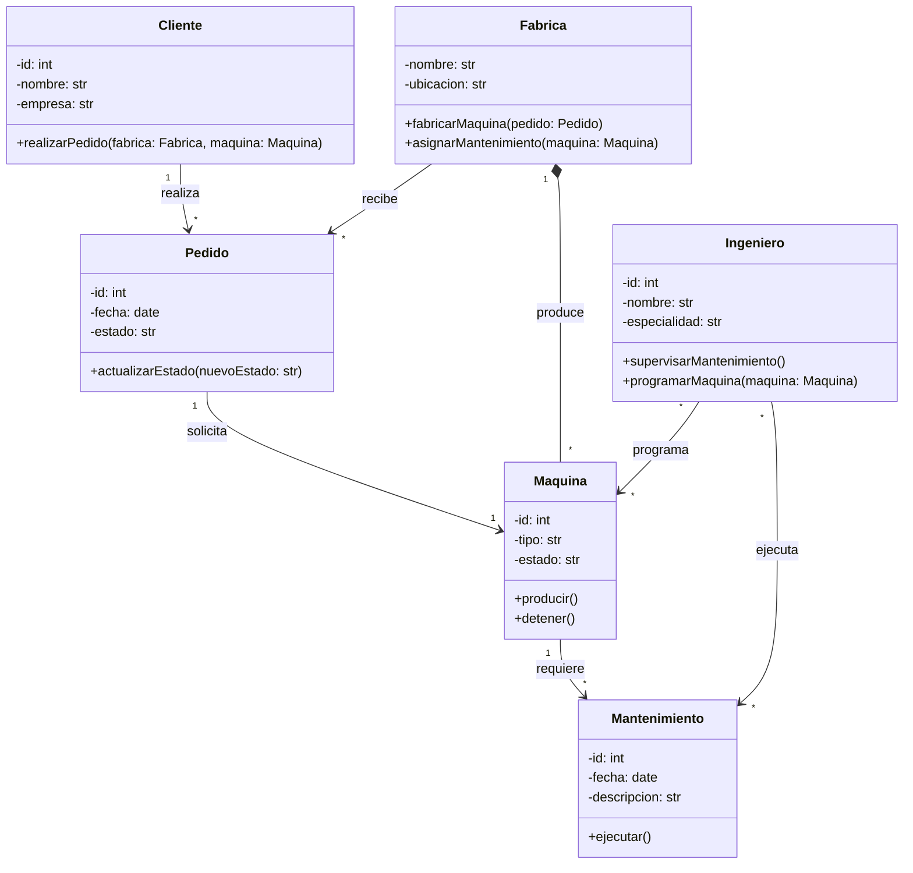

# Reto-2
Desarrolle la mayoría de ejercicios en clase. Para cada punto cree un programa individual. Al finalizar suba todo a un repo y súbalo al canal reto_2 en slack.

Elija un problema de la vida real (sistema de gestión de biblioteca, negocio de compra-venta, automóvil, etc) que se pueda modelar a través de objetos y clases. Plantee las relaciones de clases, composiciones, propiedades y comportamientos del sistema en uno mas diagramas tipo UML.

**Ejemplo Usado**: Fábrica de automatización de máquinas industriales.Este programa permite:

-Registrar distintos tipos de máquinas industriales que heredan características específicas.

-Mantener un inventario de las máquinas producidas por la fábrica.

-Agregar clientes que heredan ciertas características generales.

-Gestionar los pedidos de máquinas que los clientes realicen.

-Administrar los mantenimientos de las máquinas, asignados y supervisados por ingenieros especializados.

  
